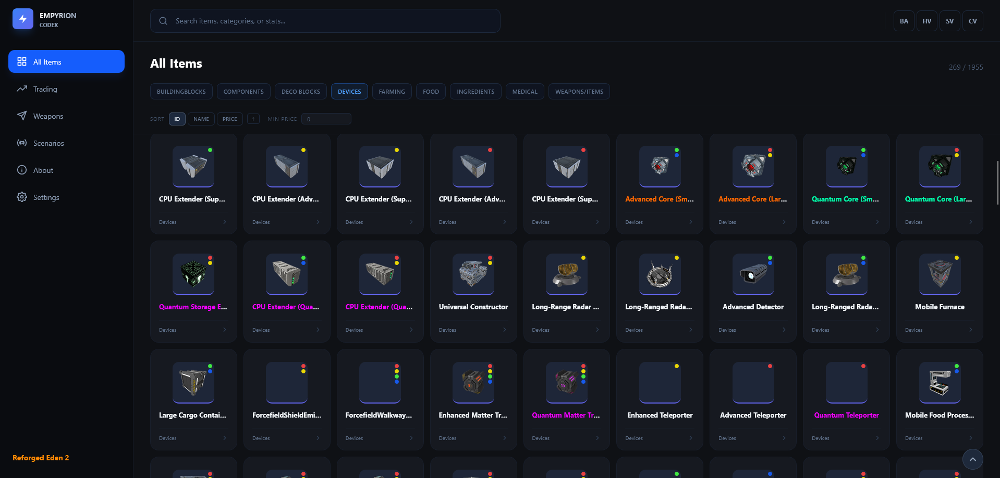

# Empyrion Codex

A community-made browser tool for exploring scenario data from [Empyrion - Galactic Survival](https://store.steampowered.com/app/383120/Empyrion__Galactic_Survival/). Look up any item, block, or trader across any scenario — with no installation and no tracking.

The Empyrion Codex can be viewed at https://empyrion-codex.com, and will make it easy for you to plan your gameplay efficiently. You can look up specific items for a quick overview of the most important details, find the most profitable traders, track their locations, and plan your routes. If you're trying to decide between two blocks or devices, you can easily compare them and find the one that best fits your needs.

Everything runs entirely in your browser. Your files never leave your device.

> **Disclaimer:** Empyrion Codex is an independent, community-made tool and is not affiliated with, endorsed by, or in any way officially connected to Eleon Game Studios or the Empyrion - Galactic Survival game.

---



---

## Table of contents

- [Features](#features)
- [Getting Started](#getting-started)
- [Loading data](#loading-data)
- [Self-hosting](#self-hosting)
- [Project structure](#project-structure)
- [Tech stack](#tech-stack)
- [Accessibility](#accessibility)
- [Contributing](#contributing)
- [License](#license)
- [Acknowledgements](#acknowledgements)

---

## Features

- **Browse items & blocks** — search by name, category, or stats; filter by vessel type (BA / HV / SV / CV) and category; sort by ID, name, or market price; filter by minimum price
- **Item comparison** — pin up to 4 items and compare them side-by-side in a full-screen overlay, with differing rows highlighted
- **Shareable links** — copy a direct link to any item; the URL auto-opens that item's detail drawer on load
- **Weapon damage matrix** — colour-coded matrix of every weapon vs. configurable block-material columns; tier bands (Ineffective / Normal / Effective / Very Effective) are computed empirically from the scenario's own `DamageMultiplierConfig.ecf` data
- **Block lookup** — select any block and see every weapon ranked by its damage multiplier against that specific block type
- **Browse traders** — see what each NPC sells and buys, with estimated price ranges and stock quantities
- **Trade opportunities** — find items that one trader sells and another buys, sorted by estimated profit
- **Trader location tracking** — save trader locations with POI, playfield, and restock interval; live countdown timers show when a trader is ready to visit again
- **Trade route planning** — build named routes from your saved locations, with per-stop and total profit estimates
- **Export user data** — export your saved locations and routes as re-importable JSON or human-readable CSV
- **Crafting recipes** — view full ingredient lists broken down by constructor type, with links to ingredient items
- **Localization** — loads display names and rich-text descriptions from `Localization.csv`, including in-game color formatting
- **Item icons** — resolved automatically when loading a scenario folder, or bundled into `.empcdx` exports
- **Featured scenarios** — load specific server-stored scenarios with a single click — no local files needed
- **Scenario import/export** — package all loaded data into a single `.empcdx` file for instant reloading without the original ECF files
- **Saved scenarios** — recently loaded scenarios are cached in your browser's IndexedDB automatically
- **Mobile-friendly** — fully responsive layout with a collapsible sidebar for phones and tablets
- **Accessible** — high-contrast dark theme, adjustable UI scale in Settings, and keyboard navigation throughout
- **No backend, no runtime dependencies** — once built, it's a static web app; open `index.html` in any modern browser and go

---

## Getting Started

### Prerequisites

- [Node.js](https://nodejs.org/) — needed to build the CSS bundle and to serve the app locally
- A modern browser (Chrome, Edge, or Firefox)

### Running locally

```bash
# Install dev dependencies
npm install

# Build the Tailwind CSS bundle
npm run build

# Serve the app over HTTP (required — file:// won't work)
npm start
```

`npm start` serves the `src/` folder on `http://localhost:3000` using [serve](https://github.com/vercel/serve).

> **Note:** You must serve the app over HTTP — opening `index.html` directly as a `file://` URL will not work. Browsers block ES module imports under `file://` due to CORS restrictions. Any local HTTP server works; `npm start` is the easiest option.

### During development

```bash
# Rebuild CSS automatically on file changes
npm run watch
```

---

## Loading data

### Option A — Import a scenario folder

Click **Import Scenario** on the Scenarios page and select the root folder of any Empyrion scenario. The tool will automatically find and load `ItemsConfig.ecf`, `BlocksConfig.ecf`, `TraderNPCConfig.ecf`, `Templates.ecf`, `TokenConfig.ecf`, `DamageMultiplierConfig.ecf`, and `Localization.csv`.

Vanilla scenarios are usually at:
```
…\Steam\steamapps\common\Empyrion - Galactic Survival\Content\Scenarios
```

Workshop scenarios are usually at:
```
…\Steam\steamapps\workshop\content\383120
```

### Option B — Load individual files

Use the individual upload buttons to load one or more ECF files and/or a Localization CSV at your own pace.

### Option C — Import a `.empcdx` file

If you or someone else previously exported data via the **Export** button, you can load the resulting `.empcdx` file directly to restore all data at once, without needing the original ECF files. A few scenarios ship pre-bundled with the app and can be loaded directly from the Scenarios page with one click.

---

## Self-hosting

Two files are intentionally excluded from the repository because they contain deployment-specific data (server paths, large bundled scenario files). If you want to run your own public instance, you need to create them:

### `src/parserConfig.json`

Controls what the parsers load and how the Weapons page is configured (column groups, tier percentile thresholds, blocked properties). Copy `src/parserConfig.example.json` from the repository and adjust to taste.

### `src/scenarios/manifest.json`

Lists the scenarios available via the one-click "Featured" loader on the Scenarios page. Each entry points to a `.empcdx.gz` file served from the same origin. Copy `src/scenarios/manifest.example.json` from the repository and add your own entries.

If you only need to run the app locally and don't need featured scenarios, create an empty manifest:

```json
[]
```

---

## Project structure

```
src/
├── app.js                          # Application entry point — wiring, state, UI orchestration
├── db.js                           # IndexedDB wrapper (saved scenarios, locations, routes)
├── index.html                      # Single-page shell
├── input.css                       # Tailwind CSS entry point
├── parserConfig.example.json       # Schema + defaults for parserConfig.json (committed)
├── parserConfig.json               # Active parser config — NOT committed (see Self-hosting)
├── parsers/
│   ├── BaseConfigParser.js         # Abstract base with Template Method pattern for ECF parsing
│   ├── BlocksConfigParser.js
│   ├── DamageMultiplierConfigParser.js
│   ├── ItemsConfigParser.js
│   ├── LocalizationParser.js
│   ├── MaterialsConfigParser.js
│   ├── ParserFactory.js            # Maps ECF filenames to the correct parser class
│   ├── parserConfig.js             # Re-exports typed constants from parserConfig.json
│   ├── TemplatesConfigParser.js
│   ├── TokenConfigParser.js
│   ├── TraderNPCConfigParser.js
│   ├── ecf/
│   │   ├── EcfBlock.js             # Parsed ECF block node
│   │   ├── EcfParser.js            # Low-level ECF tokeniser/parser
│   │   └── EcfProperty.js          # Key/value property on a block
│   └── models/
│       ├── Block.js
│       ├── DamageMultiplier.js
│       ├── Item.js
│       ├── Material.js
│       ├── Template.js
│       ├── Token.js
│       └── TraderNPC.js
├── scenarios/
│   ├── manifest.example.json       # Schema + example for manifest.json (committed)
│   └── manifest.json               # Active featured-scenario index — NOT committed (see Self-hosting)
└── ui/
    ├── buildLocationForm.js        # Inline add/edit form for trader locations
    ├── categoryIcons.js            # SVG icon map by item category
    ├── CompareBuilder.js           # Pure data logic for aligning and diffing item stats
    ├── CompareRenderer.js          # Renders the full-screen item comparison overlay
    ├── CompareState.js             # Observable state container for pinned items (max 4)
    ├── exportCodex.js              # Exports locations and routes to JSON or CSV
    ├── ItemDetailRenderer.js       # Detail drawer for items and blocks
    ├── ItemListRenderer.js         # Items grid with lazy rendering and virtual unload
    ├── LocationsPageRenderer.js    # Renders the My Locations page
    ├── renderUtils.js              # Shared escaping, formatting, and click-handler utilities
    ├── RoutesPageRenderer.js       # Renders the Routes page and the route builder
    ├── TraderDetailRenderer.js     # Detail drawer for traders
    ├── TraderLocationEditor.js     # Inline location editor embedded in the trader drawer
    ├── TraderRenderer.js           # Trader cards grid with lazy rendering and virtual unload
    └── WeaponsPageRenderer.js      # Weapon damage matrix and block-lookup views
```

---

## Tech stack

| Concern | Choice |
|---|---|
| Language | Vanilla JavaScript (ES modules, no framework) |
| Styling | [Tailwind CSS v4](https://tailwindcss.com/) |
| Persistence | Browser IndexedDB |
| Build | Tailwind CLI only |
| Runtime dependencies | None |

---

## Accessibility

Empyrion Codex is built with accessibility in mind:

- **Contrast** — the dark theme uses high-contrast text throughout, so content stays readable without straining your eyes during long sessions.
- **UI scale** — the Settings page lets you scale the interface up or down to suit your display and preference.
- **Keyboard navigation** — the app is navigable via the keyboard (Tab, Enter, Escape).

---

## Contributing

Contributions are welcome — bug fixes, new features, parser improvements, and general polish are all fair game.

### How to contribute

1. **Fork** the repository and create a branch from `main`.
2. **Make your changes.** Keep commits focused; one logical change per commit is ideal.
3. **Test manually** in at least one browser with a real scenario folder.
4. **Open a pull request** with a clear description of what changed and why.

If you're planning something larger, opening an issue first to discuss the approach is appreciated — it saves everyone time.

### Guidelines

- **Scope** — keep PRs focused. Avoid bundling unrelated changes.
- **Style** — match the existing code style (vanilla JS ES modules, JSDoc for public APIs, Tailwind utility classes, no new runtime dependencies).
- **Security** — always escape user-visible strings via `escapeHtml` before inserting into innerHTML. Avoid `eval` and dynamic `import()` on user-provided data.
- **Comments** — explain *why*, not *what*. Self-evident code doesn't need a comment.
- **No breaking changes to the `.empcdx` format** without a version bump and a migration path.

### Bug reports

Please use the [GitHub issue tracker](https://github.com/DrDarkDK/empyrion-codex/issues). Include:
- What you expected to happen
- What actually happened
- The browser and version you were using
- A sample ECF file or scenario name, if relevant

---

## License

[ISC](https://opensource.org/licenses/ISC)

---

## Acknowledgements

Inspired by [EmpyrionBuddy](https://empyrionbuddy.com) — a great tool in its own right, well worth checking out.